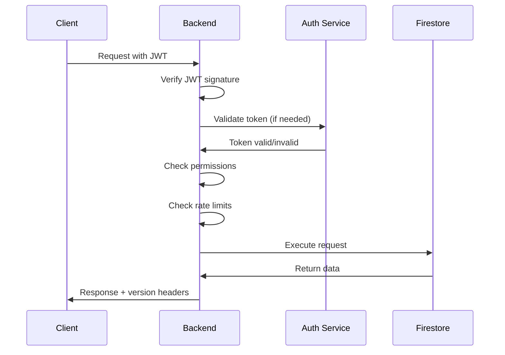

# Versioning and Compatibility Specification

**Document Version**: 1.0.0  
**Last Updated**: August 13, 2025  
**Status**: Draft  
**Applies To**: Generic Backend Service v2.0.0, Frontend SDK v2.3.1  

## Version Strategy

### 1. Semantic Versioning
The Generic Backend Service follows **Semantic Versioning 2.0.0** (SemVer):
- **MAJOR.MINOR.PATCH** (e.g., 2.3.1)
  - **MAJOR**: Breaking changes that require miniapp updates
  - **MINOR**: New features, backward compatible
  - **PATCH**: Bug fixes, backward compatible

### 2. Version Components

#### 2.1 Backend Service Version
```yaml
Service Version: 2.0.0
Supported API Versions: [v1, v2]
Deprecated API Versions: []
SDK Compatibility: >=1.0.0 <3.0.0
```

#### 2.2 API Version
```yaml
Current: v2
Previous: v1 (supported until 2026-01-01)
Legacy: v0 (deprecated, removal 2025-07-01)
```

#### 2.3 SDK Version
```yaml
SDK Version: 2.3.1
Backend Compatibility: >=1.5.0
API Version Support: [v1, v2]
```

## API Versioning

### 1. Version Declaration

#### 1.1 URL Path Versioning (Primary)
```
/v1/api/collections
/v2/api/collections
```

#### 1.2 Header Versioning (Alternative)
```http
X-API-Version: v2
Accept: application/vnd.olamo.v2+json
```

#### 1.3 Query Parameter (Fallback)
```
/api/collections?api_version=v2
```

### 2. Version Negotiation

```javascript
// Client request
{
  "preferredVersion": "v2",
  "acceptableVersions": ["v2", "v1"],
  "minimumVersion": "v1"
}

// Server response
{
  "negotiatedVersion": "v2",
  "serverVersions": ["v2", "v1"],
  "deprecationWarnings": []
}
```

## Backward Compatibility

### 1. Compatibility Rules

#### 1.1 Always Backward Compatible
- Adding new optional fields to responses
- Adding new endpoints
- Adding new optional query parameters
- Adding new WebSocket event types
- Extending enums with new values

#### 1.2 Breaking Changes (Require Major Version)
- Removing or renaming fields
- Changing field types
- Removing endpoints
- Changing authentication methods
- Modifying required parameters

### 2. Deprecation Policy

```yaml
Deprecation Timeline:
  1. Announce: 6 months before deprecation
  2. Deprecate: Mark as deprecated, still functional
  3. Sunset: 3 months warning before removal
  4. Remove: Complete removal from service

Notification Channels:
  - API response headers
  - WebSocket messages
  - Dashboard notifications
  - Email to developers
```

### 3. Response Headers

```http
# Deprecation warnings
X-Deprecated: true
X-Sunset-Date: 2025-12-31
X-Deprecation-Info: https://docs.olamo.app/deprecations/auth-v1

# Version information
X-API-Version: v2
X-Service-Version: 2.3.1
X-Min-Client-Version: 1.0.0
X-Recommended-Client-Version: 2.0.0
```

## Forward Compatibility

### 1. Client Requirements

```javascript
// SDK must handle unknown fields gracefully
class OlamoSDK {
  parseResponse(response) {
    const known = this.extractKnownFields(response);
    const unknown = this.extractUnknownFields(response);
    
    if (unknown.length > 0) {
      console.warn('Unknown fields in response:', unknown);
      this.storeForFutureUse(unknown);
    }
    
    return known;
  }
}
```

### 2. Feature Detection

```javascript
// Check for feature availability
const capabilities = await olamo.getCapabilities();

if (capabilities.supports('batch-operations')) {
  await olamo.api.batchCreate(items);
} else {
  // Fallback to individual creates
  for (const item of items) {
    await olamo.api.create(item);
  }
}
```

### 3. Progressive Enhancement

```javascript
// Use new features when available
const config = {
  // New in v2
  optimisticUpdates: capabilities.version >= 'v2',
  
  // New in v2.1
  offlineSync: capabilities.version >= 'v2.1',
  
  // Fallback for older versions
  legacyMode: capabilities.version < 'v2'
};
```

## Enhanced Authentication Security

### 1. JWT Token Structure

```json
{
  "header": {
    "alg": "RS256",
    "typ": "JWT",
    "kid": "key-id-2025-01"
  },
  "payload": {
    "iss": "https://auth.olamo.app",
    "sub": "user:123456",
    "aud": ["api.olamo.app", "miniapp:todo-app"],
    "exp": 1234567890,
    "iat": 1234567890,
    "nbf": 1234567890,
    "jti": "unique-token-id",
    
    "user": {
      "uid": "123456",
      "email": "user@example.com",
      "displayName": "John Doe",
      "photoURL": "https://...",
      "emailVerified": true
    },
    
    "context": {
      "groupId": "group-123",
      "miniappId": "todo-app",
      "role": "member",
      "permissions": ["read", "write"],
      "sessionId": "session-789"
    },
    
    "security": {
      "tokenVersion": 2,
      "refreshable": true,
      "mfa": true,
      "trustLevel": "high"
    },
    
    "client": {
      "ip": "192.168.1.1",
      "userAgent": "Mozilla/5.0...",
      "device": "desktop",
      "platform": "web"
    }
  }
}
```

### 2. Token Security Features

#### 2.1 Token Rotation
```javascript
class TokenManager {
  async rotateToken() {
    const newToken = await this.requestNewToken(this.refreshToken);
    const overlap = 30000; // 30 second overlap
    
    setTimeout(() => {
      this.revokeOldToken(this.currentToken);
    }, overlap);
    
    this.currentToken = newToken;
    return newToken;
  }
}
```

#### 2.2 Token Binding
```javascript
// Bind token to device/session
const tokenBinding = {
  deviceFingerprint: await getDeviceFingerprint(),
  sessionId: generateSessionId(),
  ipAddress: await getClientIP()
};

// Verify binding on each request
if (!verifyTokenBinding(token, currentBinding)) {
  throw new SecurityError('Token binding mismatch');
}
```

#### 2.3 Rate Limiting
```yaml
Token Operations:
  Creation: 10 per hour per user
  Refresh: 60 per hour per token
  Verification: 1000 per minute per IP
  Revocation: 20 per hour per user
```

### 3. Authentication Flow



## Version Migration

### 1. Migration Paths

```yaml
From v1 to v2:
  Breaking Changes:
    - Authentication: Bearer token required (was optional)
    - Response format: Standardized envelope
    - WebSocket: New connection protocol
  
  Migration Steps:
    1. Update SDK to 2.x
    2. Update authentication code
    3. Update response parsing
    4. Test in staging environment
    5. Deploy with fallback
```

### 2. Dual Version Support

```javascript
class DualVersionAPI {
  async request(endpoint, options) {
    try {
      // Try v2 first
      return await this.v2.request(endpoint, options);
    } catch (error) {
      if (error.code === 'VERSION_NOT_SUPPORTED') {
        // Fallback to v1
        console.warn('Falling back to API v1');
        return await this.v1.request(endpoint, options);
      }
      throw error;
    }
  }
}
```

### 3. Version Detection

```javascript
// Auto-detect best version
async function detectBestVersion() {
  const versions = await fetch('/api/versions').then(r => r.json());
  
  const clientSupported = ['v2', 'v1'];
  const serverSupported = versions.supported;
  
  // Find best match
  for (const version of clientSupported) {
    if (serverSupported.includes(version)) {
      return version;
    }
  }
  
  throw new Error('No compatible version found');
}
```

## Configuration in miniapp.json

```json
{
  "name": "Todo App",
  "version": "1.2.3",
  "compatibility": {
    "backend": {
      "minimum": "1.5.0",
      "maximum": "3.0.0",
      "recommended": "2.0.0"
    },
    "api": {
      "versions": ["v2", "v1"],
      "preferred": "v2"
    },
    "sdk": {
      "minimum": "2.0.0",
      "maximum": "3.0.0"
    }
  },
  "features": {
    "required": [
      "crud-operations",
      "websocket",
      "authentication"
    ],
    "optional": [
      "batch-operations",
      "file-upload",
      "offline-sync"
    ]
  },
  "fallbacks": {
    "batch-operations": "individual-operations",
    "offline-sync": "online-only"
  }
}
```

## Version Compatibility Matrix

| Backend Version | API Versions | SDK Versions | Features | Status |
|----------------|--------------|--------------|----------|--------|
| 3.0.0 | v3, v2 | 3.x, 2.x | All + AI | Future |
| 2.0.0 | v2, v1 | 2.x, 1.x | All | Current |
| 1.5.0 | v1 | 1.x | Basic + WS | Supported |
| 1.0.0 | v1 | 1.x | Basic | Deprecated |
| 0.9.0 | v0 | 0.x | Beta | Sunset |

## Client-Side Version Handling

```javascript
class OlamoSDK {
  constructor(config = {}) {
    this.version = '2.3.1';
    this.apiVersion = config.apiVersion || 'v2';
    this.compatibility = {
      minBackend: '1.5.0',
      maxBackend: '3.0.0',
      apiVersions: ['v2', 'v1']
    };
  }
  
  async init() {
    // Check version compatibility
    const serverInfo = await this.getServerInfo();
    
    if (!this.isCompatible(serverInfo)) {
      if (this.canUpgrade(serverInfo)) {
        console.warn('SDK update recommended');
        this.showUpgradePrompt();
      } else {
        throw new Error('Incompatible versions');
      }
    }
    
    // Store server capabilities
    this.capabilities = serverInfo.capabilities;
    this.negotiatedVersion = serverInfo.negotiatedVersion;
    
    // Setup deprecation warnings
    this.setupDeprecationHandlers(serverInfo.deprecations);
  }
  
  isCompatible(serverInfo) {
    return this.compareVersions(serverInfo.version, this.compatibility.minBackend) >= 0 &&
           this.compareVersions(serverInfo.version, this.compatibility.maxBackend) <= 0;
  }
}
```

## Testing Version Compatibility

```javascript
// Test suite for version compatibility
describe('Version Compatibility', () => {
  test('v1 client with v2 backend', async () => {
    const client = new OlamoSDK({ apiVersion: 'v1' });
    const response = await client.api.get('/test');
    expect(response).toBeDefined();
    expect(client.negotiatedVersion).toBe('v1');
  });
  
  test('v2 client with v1 backend', async () => {
    const client = new OlamoSDK({ apiVersion: 'v2' });
    await expect(client.init()).rejects.toThrow('Incompatible');
  });
  
  test('handles unknown fields gracefully', async () => {
    const response = {
      knownField: 'value',
      unknownField: 'future-value'
    };
    const parsed = client.parseResponse(response);
    expect(parsed.knownField).toBe('value');
    expect(console.warn).toHaveBeenCalled();
  });
});
```

## Monitoring and Analytics

```yaml
Version Metrics:
  - API version usage distribution
  - SDK version adoption rate
  - Deprecation warning frequency
  - Version mismatch errors
  - Fallback usage statistics
  - Upgrade success rate

Alerts:
  - High rate of version mismatches
  - Deprecated version usage spike
  - Failed version negotiations
  - Security token violations
```

This comprehensive versioning and compatibility specification ensures smooth operation across different versions while maintaining security and providing clear upgrade paths.